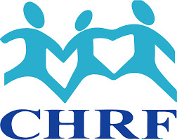
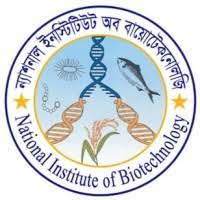

:::  panel-tabset

# **Welcome!**
Hello, I am *[Preonath Chondrow Dev](https://github.com/preonath/preonath.github.io)*. I am a **Bioinformatician** at the [Child Health Research Foundation](https://chrfbd.org/) to improve child health in Bangladesh and around the world by facilitating appropriate policy decisions through research and advocacy. I am also working as a mentor at [Bioinformatics School](https://www.facebook.com/groups/390262838074549/?hoisted_section_header_type=recently_seen&multi_permalinks=1429385037495652). 

As a **bioinformatician**, I combine my knowledge in **biochemistry, molecular biology, and computer science** to further the cause of improving human health by developing and implementing state-of-the-art computational methods with the sincere intention of illuminating the route to new discoveries and solutions by teasing apart the genomic complexities of diseases through highly engaging and fruitful collaborations.

# **Experience**

 <!-- Add padding to account for logo -->
    **Bioinformatician** \| [Child Health Research Foundation(CHRF)](https://chrfbd.org/), Dhaka, Bangladesh | (2022 - Present)  
    

  <!-- Adjust breaks as needed -->

 <!-- Add padding to account for logo -->
    **Research Fellow** \| [National Institute of Biotechnology(NIB)](http://www.nib.gov.bd/), Dhaka, Bangladesh \| (Sept 2021 - June 2022)  
    

  <!-- Adjust breaks as needed -->

 <!-- Add padding to account for logo -->
    **Academic Team Member** \| [Bangladesh Mathematical Olympiad(BdMO)](https://matholympiad.org.bd/), Dhaka, Bangladesh \| (2017 - 2019)  
    

# **Skills**

**Programming Languages:** C, Python, Bash, R, Java, Nextflow

**Database Management System: ** SQL, MySQL, SQLite3, Redis

**Data Science:** Numpy, Pandas, Malplotlib, Seaborn, Keras, SciKit-Learn, PyTorch, TensorFlow

**Analytics Softwares:** SPSS, STATA, Microsoft Excel

**Academic Writing Tools:** Microsoft Word, LaTeX, R Markdown Quarto

**Bioinformatics:** 
BioPython, Bioconductor, BioPandas, Microarray analysis, RNASeq 
  <ul style="margin-left: 20px;">
    <li><strong>NGS:</strong> Converting(BCL2fastq), Quality checking(fastQC, MultiQC, Quast), Quality control(Trimmomatic), Assembly(Unicycler, Spades, Megahit, Pilon, Flye), Assembly viewer (Bandage)</li>
    <li><strong>Annotation:</strong> AMRFinderPlus, Abricate, SRST, MLST, Snippy, Mafft, fasta2phylip, Raxml-ng, Poppunk, PlasmidFinder, ResFinder, Blast, Pharokka, Virustaxo, Kraken2, Prokka, Seroba, bwa, bowtie2, samtools, bamtools, bcftools, snp-sites, BLAST, snippy, FastTree, Gubbins, popPUNK, Abricate, Any2fasta, ARIBA, SeroBA, SRST2, mlst, IGV, CZID, Nextstrain</li>
    <li><strong>Single Cell RNA sequencing Analysis:</strong> Scanpy, Seurat</li>
  </ul>

**Miscellaneous Skills:** UNIX, Version Control(Git), Web Scraping

# Education

 <!-- Add padding to account for logo -->
    **Master of Science (2020 - 2022)**  
    Institution: [Shahjalal University of Science and Technology(SUST), Sylhet, Bangladesh](https://www.sust.edu/)  
    School of Life Sciences  
    Major: Biochemistry and Molecular Biology  
    

  <!-- Adjust breaks as needed -->

 <!-- Add padding to account for logo -->
    **Bachelor of Science (2016 - 2019)**  
    Institution: [Shahjalal University of Science and Technology(SUST), Sylhet, Bangladesh](https://www.sust.edu/)  
    School of Life Sciences  
    Major: Biochemistry and Molecular Biology  
    

:::
