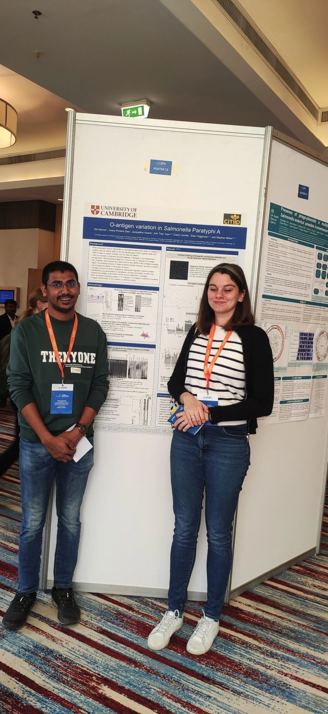
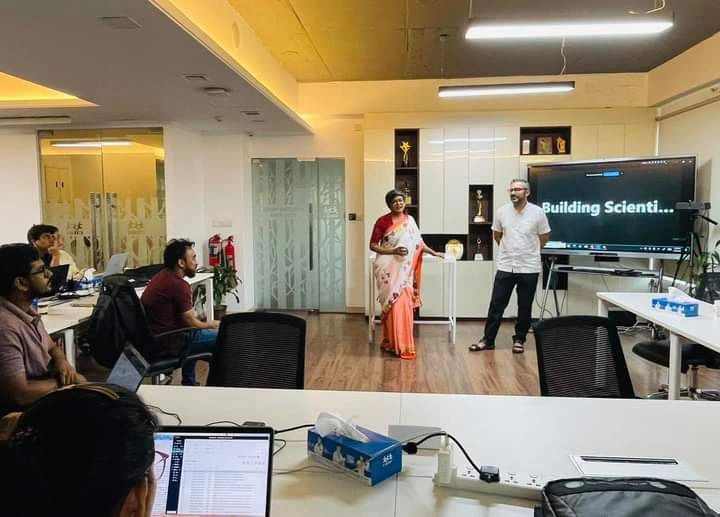
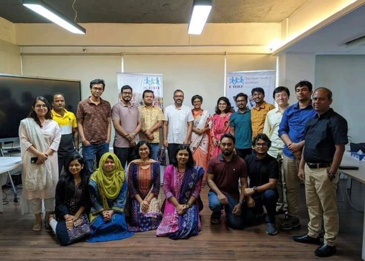

<!-- HTML Structure -->

  

  

  

  

  

<!-- Text Overlay on the Image Slider -->

  <h1 style="font-size: 3em; font-weight: bold; text-align: center;">Bacterial Genomics & Antimicrobial Resistance Workshop</h1>
  
A Comprehensive 5-Day Workshop on Bacterial Genomics and Antimicrobial Resistance

<!-- Program Details Below the Image Slider -->

  <h2 style="text-align: center; font-weight: bold;">Program Outline & Learning Objectives</h2>
  <ul style="list-style-type: none; padding: 0;">
    <li><strong>Introduction:</strong> to bacterial genomics and bioinformatics</li>
    <li><strong>Bacterial Genome Analysis:</strong> From sequence data to genomes</li>
    <li><strong>Antimicrobial Resistance:</strong> Factors, genes, and pathways</li>
    <li><strong>Comparative Genomics:</strong> and phylogenetics</li>
    <li><strong>Applications:</strong> of bacterial genomics in research and clinical settings</li>
  </ul>

  <h3 style="text-align: center; font-weight: bold;">Workshop Duration & Location</h3>
  
Duration: 5 days   Location: CHRF-HQ, Shyamoli, Dhaka, Bangladesh

  <h3 style="text-align: center; font-weight: bold;">Apply Now</h3>
  

    <a href="https://chrfbd.org/pages/building-scientists-for-bangladesh/program/13c4f00f-6201-42df-885c-dca0e2fb948b" class="btn btn-primary rounded-pill me-2">Program Website</a>
  

<!-- CSS -->

<!-- JavaScript for sliding effect -->

